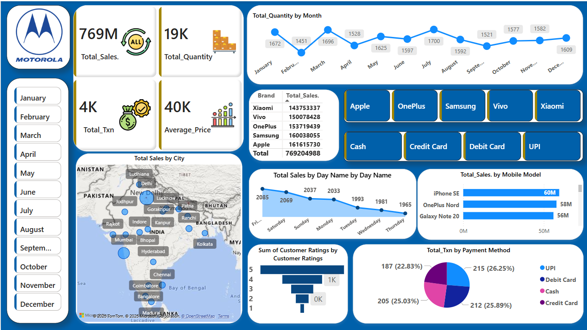

# 📱 Mobile Phone Sales Dashboard

An interactive Power BI dashboard analyzing mobile phone sales performance across different regions and product categories.

## 📊 Key Features

- 📅 Monthly and Quarterly Sales Trends
- 📈 Total Sales by Brand and Model
- 🌍 Sales Breakdown by Region
- 🧮 Filters for Date, Region, Brand, and Store

## 📁 Project Structure

| File / Folder | Description |
|---------------|-------------|
| `Mobile_Phone_Sales_Dashboard.pbix` | Main Power BI file with all visuals and imported data |
| `Data/Mobile Sales Data.xlsx` | Source data used in the dashboard |
| `Dashboard_Images/Dashboard_Screenshot.png` | Preview image of the final dashboard |

## 📎 Notes

- The `.pbix` file includes imported data, so it opens without needing the original Excel source.
- No credentials or external connections required.

## 🖼️ Dashboard Preview

